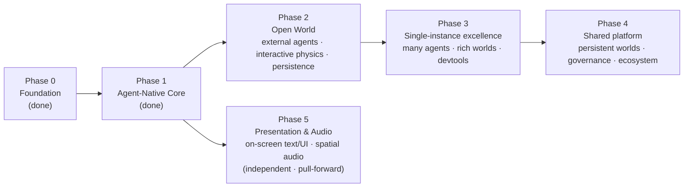

# Limina Roadmap

> **Vision:** an agent-native, high-performance real-time 3D engine where LLM agents —
> external **Agent Builders** and in-world **Agent Players** — are first-class citizens,
> every action typed, permission-checked, and traced.
> **Source spec:** `README.md` · **Standing principle:** performance-first (see below).
>
> Plans live as hand-authored Markdown in `plans/` (the hosted Plan connector is not
> configured in this repo). Phase 2 is an **executable** plan; Phases 3–4 are
> **roadmap-level** — themes, pillars, bets, and dependencies, detailed at kickoff.

## Where we are

| Phase | Theme | Status |
|---|---|---|
| **0 — Foundation** | Native runtime + render + physics + ECS + loop | ✅ COMPLETE (`plans/limina-phase-0-foundation/plan.md`) |
| **1 — Agent-Native Core** | Skill registry, MCP, observability, agent ecosystem | ✅ COMPLETE (`plans/limina-phase-1-agent-core/plan.md`) |
| **2 — Open World** | Real external agents + interactive world + persistence | ✅ COMPLETE — built, reviewed, gaps fixed (`plans/limina-phase-2-open-world/plan.md`) |
| **3 — Single-Instance Scale & Fidelity** | Many agents + data ownership/job system + rich worlds + devtools | ✅ **COMPLETE** — review-gap fix pass (scheduler/budgets, spatial index, devtools, shadows+textures, perf 9.4→74fps) **+ native parallelism**: profile-first found the wall was an un-cached `registry.list()` (`z.toJSONSchema`/agent/tick) → memoized; then a native CSR spatial op (`limina-ecs`, rayon, bit-identical to the JS oracle, 4.5–5.4× / ≤2 ms) wired into perception (byte-identical); `MAX_ENTITIES`→16384; **density capstone: 200 agents + 256 dynamic bodies + 2000 entities @ sim-step p95 4 ms ≤ 8 ms**. 38/38 headless + spike + capstone. (Untrusted-code **isolation substrate** was delivered in Phase 4/M6 — QuickJS.) (`plans/limina-phase-3-scale-fidelity/plan.md`) |
| **4 — Shared Platform** | Persistent shared worlds + governance + ecosystem + browser/wasm target | ✅ **COMPLETE** (M1–M9 + spikes, verified) — durable shared worlds (replay determinism, snapshot recovery, authoritative multi-client sync p95 11ms, interest mgmt) + governed ecosystem (QuickJS isolation, dynamic policy engine, audit surfaces, versioned packages w/ manifest + attestation + content-hash provenance); 31/31 headless + capstone green. **4x/M10 browser-wasm optional/pull-on-demand** (`plans/limina-phase-4-platform/plan.md`) |
| **5 — Presentation & Audio** | On-screen text/UI rendering + spatial audio (multimodal output) | ✅ **COMPLETE & verified** — **P5-A (Text/UI):** expressive in-scene containers (text/speech/thought/callout/label + screen HUD), builder-styled, billboard/anchored/lifecycle, via permission-gated traced `ui.*` skills; embedded font → `DataTexture`. **P5-B (Audio):** `limina-audio` (rodio 0.22.2/cpal) — dedicated audio thread, 4-bus mixer (master/sfx/ambience/voice), spatial `SpatialPlayer` (camera-listener + 1/d²), 12 `audio.*` ops, permissioned/traced `audio.*` skills, Rust-side **fire-and-forget TTS** (espeak/Piper; never freezes the frame); backend explicit via `LIMINA_AUDIO=null` (device-free CI). **Capstone demos:** `forest_conversation.ts` — agents hold a real non-deterministic Ollama conversation in speech bubbles **and speak it aloud** over an ambient bed; `numbers_party.ts` — ambient bed + positional chatter as the flythrough camera sweeps the crowd (102 fps). 52 headless pass + capstone; clippy/fmt 0; procedural synthesis (no audio assets), voice via espeak-ng (`plans/limina-phase-5b-audio/plan.md`, `plans/limina-phase-5-presentation-audio/plan.md`) |

**Shipped (0+1):** one native binary — Rust host → V8 (`deno_core`) → WebGPU (`deno_webgpu` + Three.js) → native Rapier physics → bitECS, on a fixed-timestep loop. A typed/permissioned/versioned skill registry with hooks, an **in-process** MCP `listTools`/`callTool` surface, EventLoom-shaped traces with a sha256 chain + JSONL export, and an agent ecosystem (perception → decision → action, LLM-agnostic: scripted / local Ollama / cloud gateway). Builder + player demos, all verified.

## Beyond MVP (post-0.1.0)

The production / ecosystem themes that were **out of MVP scope** now live in their own file:
[`plans/post-mvp-roadmap.md`](./post-mvp-roadmap.md) — editor / IDE integration, mobile +
packaging, a public package ecosystem, streaming / multi-turn tools, and advanced external
memory adapters. The original MVP spec is preserved at [`docs/mvp-spec.md`](../docs/mvp-spec.md).

## The arc

## Why this order (dependency rationale)

- **2 before 3.** You cannot *scale* agents you cannot *connect*, nor scale a world that
  is not yet interactive. Phase 2 opens the external MCP surface and gives the world real
  physics (collisions/events), which is exactly what Phase 3 then multiplies, instruments,
  and renders at higher fidelity.
- **3 before 4.** A shared platform only pays off once one instance can host many Agent
  Builders and Agent Players in a rich world without losing frame budget, traceability, or
  capability boundaries. Phase 3 proves that per-instance ceiling; Phase 4 persists, shares,
  and governs it.
- **Each phase ends in demoable acceptance** and de-risks the next, mirroring the 0→1 cadence.
- **5 is independent.** Presentation & Audio (on-screen text/UI rendering + spatial audio) depend only on
  the Phase 0 render/runtime foundation, not on 2–4, so they can be pulled forward on demand. **Text
  rendering is the near-term pull** — agent-conversation demos need speech bubbles + a live agent-ops HUD,
  and the runtime today has no text/canvas/font primitive (only `DataTexture`) and no audio subsystem.

## Maps onto the spec's deferrals

`README.md` explicitly deferred: persistent observability (→ **P2** durable traces),
multi-turn orchestration (→ **P2**), dynamic policy engine vs profiles (→ **P4** governance),
and browser fallback (→ **P4** wasm/browser target). Phase 1's recorded backlog is distributed
by risk: MCP network transport, multi-turn, collision events, physics richness, and spatial
index land in **P2**; agent scale, isolation substrate, ECS ownership/job-system decisions,
textured glTF, and richer devtools land in **P3**; replay-complete durable world state,
Zaxy/EventLoom structural integration, shared worlds, third-party packaging, and governance
land in **P4**.

## Standing principle: performance-first (load-bearing)

Every architectural choice is aimed at making limina **blazingly fast**. When quality or
power competes with speed, surface the tradeoff, weigh it, decide deliberately, and record
the rationale. Concretely: native hot paths (ECS iteration, physics, spatial queries) over
JS; data-oriented SoA/TypedArray storage; zero-copy buffer bridging over serialization; JS
is the scripting/agent/authoring layer, not the inner loop. Agent *thinking* always runs
off the frame loop — a slow model never drops a frame.

## Standing principle: the engine is the substrate, not the brain or the memory

Limina owns the **world** (ECS, physics, render), **perception**, the **skill/MCP surface**, and a
**durable world event log** (logging). It does NOT own the agent's *brain* or its *memory*. The
decision provider is already pluggable (`LLMProvider`: Scripted/Ollama/Gateway), and **recall is part
of the brain** — fed by perception + read access to the durable log, with any memory backend (Zaxy,
a vector DB, or none) living as an **external adapter behind the provider**, never an engine runtime
dependency. External Agent Builders bring their own memory over MCP. So: **engine = world +
perception + durable log (substrate); brain = decision + recall (pluggable); memory backend =
external.** Persisting the world well (logging) serves any memory-builder without the engine owning memory.
