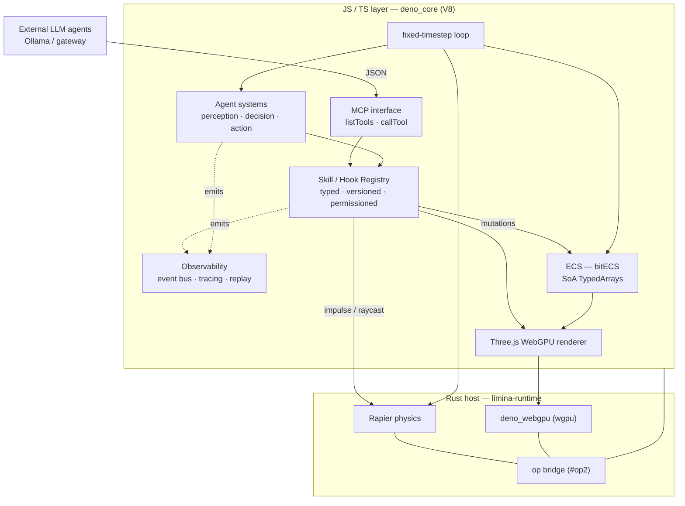
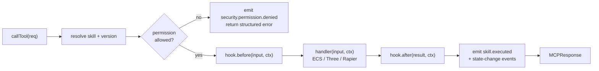
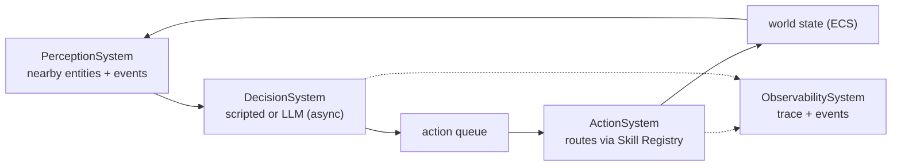

# Limina — Phase 0→1 Plan: Agent-Native Engine MVP

> **Status:** Approved · **Plan ID:** `plan-f3e376f601d044bd`
> **Hosted plan:** https://plan.agent-native.com/_agent-native/open?app=plan&view=plan&to=%2Fplans%2Fplan-f3e376f601d044bd&planId=plan-f3e376f601d044bd
> **Source spec:** `README.md` · **Local copy of the approved visual plan. Not yet started.**

Stand up the Rust + deno_core (V8) runtime and the four MVP pillars — Skill/Hook Registry, MCP interface, Observability, Agent ecosystem — starting from an empty repo.

## Outcome

A running desktop build of **limina** where an **external LLM Agent Builder** connects over an MCP-style interface, calls a small set of typed engine skills to construct a 3D scene, and every action is permission-checked and traced — while an autonomous **Agent Player** lives in the same ECS world running a perception → decision → action loop. This plan takes the repo from **zero application code** (only the existing Zaxy/EventLoom memory scaffolding) through **Phase 0 (Foundation)** into **Phase 1 (Agent-Native Core)** per `README.md`.

The plan leads with the **hard-to-reverse contracts** (skill identity, MCP wire format, event envelope, IDs) because agents, traces, and the future persistent EventLoom will all serialize against them — getting those right early costs little; changing them after data and callers exist is expensive.

## Settled runtime decision

JS runtime is **V8 via Rust + `deno_core` (rusty_v8)** + **`deno_webgpu` (wgpu)** + native **Rapier**. We do NOT build a custom JS engine. Performance is won architecturally — native/JIT hot paths + SoA TypedArray ECS — not by a faster interpreter. QuickJS isolates are deferred to Phase 2 for scaling many player-agent sandboxes. `deno_webgpu` is wgpu, the same family as the spec's Dawn/wgpu, so the stack is cohesive and Three.js WebGPU runs on it.

## System architecture

One process: a Rust host owns the V8 isolate, the wgpu device, and Rapier; the JS/TS layer owns the loop, ECS, renderer, and all four agent-facing pillars. External agents only ever touch the **MCP interface** — never the engine internals directly.



## Repository structure

Single monorepo: a Rust Cargo workspace for the host/native crates and a TS package for the engine + agent layer. Nothing here exists yet — this is all new. The existing `.eventloom/`, `.mcp.json`, and `AGENTS.md` stay untouched.

```
Cargo.toml                                  # Rust workspace manifest (crates/*)
crates/limina-runtime/                      # Rust host: boots deno_core (V8), registers ops, drives the main loop
crates/limina-render/                       # deno_webgpu (wgpu) device + SDL3 window/surface wiring
crates/limina-physics/                      # Rapier integration, exposed to JS via ops
crates/limina-ops/                          # #[op2] bridge: zero-copy ArrayBuffers + native calls <-> JS
js/package.json                             # TS/JS engine + agent layer
js/src/bootstrap.ts                         # Runtime entry; fixed-timestep accumulator loop driver
js/src/ecs/                                 # bitECS world, component stores (SoA TypedArrays), render-sync system
js/src/skills/registry.ts                   # Skill/Hook Registry + ExecutionContext + hook pipeline
js/src/skills/{scene,ecs,three,physics,agent}.ts   # Core skill definitions, one module per category
js/src/mcp/protocol.ts                      # MCP wire contract + listTools/callTool over the registry
js/src/observability/                       # Event bus, EventLoom-shaped envelope, tracing, replay, inspector dump
js/src/agents/                              # AgentComponent + Perception/Decision/Action/Observability systems + LLM providers
js/three/                                   # Three.js WebGPU renderer integration (TSL materials)
examples/builder-demo/                      # External agent builds a scene over MCP
examples/player-demo/                       # Autonomous player agent acts in-world
```

## Hard-to-reverse bets (decided)

These are the contracts that callers and stored data depend on. The single biggest reuse win: **align the observability event envelope with the EventLoom shape already on disk** (`.eventloom/limina-default.jsonl`), so MVP in-memory traces persist to a real EventLoom later with zero migration.

| Decision | Locked choice | Why settle now |
|---|---|---|
| Skill identity & versioning | `domain.action` name + semver `version`; discovery via `skills.list` / `skills.describe` | Agents hard-code skill names; renaming later breaks every agent script and saved trace |
| MCP wire format | `MCPRequest{tool,input,context}` / `MCPResponse{success,result,error,metadata}` JSON | External LLM agents + gateway serialize against this exact shape |
| Event envelope | Reuse EventLoom shape: `{id,type,actorId,threadId,timestamp,causedBy,payload}` | Replay + future persistent EventLoom must read MVP traces unchanged |
| Entity / agent / session IDs | Opaque stable strings (`ent_…`, `agt_…`, `ses_…`) — never raw array indices | IDs leak into traces, MCP calls, and memory; reindexing would corrupt history |
| ECS storage | SoA TypedArrays on ArrayBuffers (bitECS), JS-owned | ArrayBuffer backing keeps zero-copy native systems possible later; JS objects would foreclose it |
| Permission model | Profile-based allow-lists (`builder.readWrite`, `player.limited`) + per-skill `permissions[]` | Every skill + handler checks against it; changing the check shape touches all skills |

## Phase 0 — Foundation

Goal: a window that renders a physics-driven 3D scene from a fixed-timestep loop, all driven from TS on the V8 runtime. **The first task is a de-risking spike** — confirm Three.js WebGPU actually runs on `deno_core` + `deno_webgpu`, because that's the largest unknown in the whole stack.

- [x] **SPIKE:** Three.js WebGPU renders a triangle on deno_core + deno_webgpu _(highest-risk integration — prove it before building on it)_ — done via staged S1/S3/S4; see `plans/limina-phase-0-foundation/plan.md`
- [x] Rust workspace + deno_core runtime boots and runs a TS module
- [x] deno_webgpu device + window; clear-color frame on screen _(winit, not SDL3 — Path B native surface injection)_
- [x] Three.js WebGPU renderer draws a lit cube
- [x] Rapier integrated via ops; a falling-body sim steps deterministically
- [x] Fixed-timestep accumulator loop + RenderSystem + basic input/camera
- [x] bitECS world + a few components + render-sync system (ECS transform -> Three object)

## Phase 1 · Pillar 1 — Skill/Hook Registry

The central, typed registry every agent action flows through. A skill is a named, versioned, schema-described capability with optional before/after hooks and an `ExecutionContext` carrying identity, permissions, and a read view of the world. The `inputSchema` does double duty: it's also what `mcp.listTools()` advertises.

```typescript
// js/src/skills/registry.ts
export type SkillCategory = 'scene' | 'ecs' | 'three' | 'physics' | 'agent' | 'system';

export interface ExecutionContext {
  agentId: string;        // opaque stable id, e.g. "agt_…"
  sessionId: string;      // "ses_…"
  permissions: string[];  // resolved from the session profile
  tick: number;           // engine fixed-step clock
  world: WorldHandle;      // bitECS world + spatial index (read views)
  emit(type: string, payload: unknown, causedBy?: string[]): string; // -> event id
}

export interface SkillDefinition<I = unknown, O = unknown> {
  name: string;            // "scene.createEntity" — public, agents depend on it
  version: string;         // semver "1.0.0"
  description: string;
  category: SkillCategory;
  inputSchema: JSONSchema;  // Zod-derived; also fed to mcp.listTools()
  outputSchema: JSONSchema;
  permissions: string[];    // e.g. ["scene.write", "ecs.modify"]
  handler(input: I, ctx: ExecutionContext): Promise<O>;
  hooks?: {
    before?(input: I, ctx: ExecutionContext): Promise<void>;
    after?(result: O, ctx: ExecutionContext): Promise<void>;
  };
}

export interface SkillRegistry {
  register(def: SkillDefinition): void;
  describe(name: string): SkillDefinition | undefined;
  list(): MCPTool[];                                   // discovery + MCP
  invoke(name: string, input: unknown, ctx: ExecutionContext): Promise<unknown>;
}
```

## Phase 1 · Pillar 2 — MCP-style interface

A thin, discoverable tool-calling protocol over the registry, optimized for LLM tool use. `listTools` is derived from `SkillRegistry.list()`; `callTool` runs permission check → `before` hook → handler → `after` hook → event emission, returning a structured, agent-friendly response. This is the **only** surface external agents see.

```typescript
// js/src/mcp/protocol.ts — the wire contract external agents + the gateway serialize against.
export interface MCPTool {
  name: string;
  description: string;
  input_schema: JSONSchema;   // from SkillDefinition.inputSchema
}

export interface MCPRequest {
  tool: string;
  input: Record<string, unknown>;
  context?: { agentId: string; sessionId: string; previousResults?: unknown[] };
}

export interface MCPResponse {
  success: boolean;
  result?: unknown;
  error?: { code: string; message: string };          // structured, not a raw throw
  metadata?: { executionTimeMs: number; eventsEmitted: string[] };
}

// mcp.listTools(): MCPTool[]            -> SkillRegistry.list()
// mcp.callTool(req): Promise<MCPResponse> -> permission -> hooks -> handler
```

### callTool execution pipeline

Every agent action — builder or player — takes the same path. A failed permission check is a first-class, observable outcome, not an exception.



## Phase 1 · Pillar 3 — Observability layer

Every significant action emits an immutable, typed event. Events link by `causedBy` to form decision traces (`perception → decision → tool calls → state changes`). MVP keeps events in-memory with JSON export — but the **envelope matches the on-disk EventLoom format**, so swapping in persistent EventLoom later needs no schema change.

```typescript
// js/src/observability/event.ts
// Mirrors .eventloom/limina-default.jsonl so MVP traces persist later unchanged.
export interface EngineEvent {
  id: string;          // "evt_…"
  type: string;        // "skill.executed", "agent.decision.made", …
  actorId: string;     // agentId or "engine"
  threadId: string;    // sessionId
  timestamp: string;   // ISO-8601
  causedBy: string[];  // parent event ids -> builds the trace tree
  payload: unknown;    // includes before/after state where relevant
}

// Canonical MVP event types
//   agent.decision.made · skill.executed · ecs.component.added
//   three.material.updated · security.permission.denied

export interface Tracer {
  emit(e: Omit<EngineEvent, 'id' | 'timestamp'>): string;
  trace(agentId: string, sinceTick?: number): EngineEvent[]; // replay window
  export(agentId: string): string;                            // JSON dump
}
```

## Phase 1 · Pillar 4 — Agent ecosystem

Builders and players share one `AgentComponent` and the same skill/observability infrastructure. Four systems run under the fixed-timestep scheduler. **LLM decisions resolve asynchronously, off the frame path** — the action queue decouples slow model calls from the deterministic loop.



```typescript
// js/src/agents/component.ts
export interface AgentComponent {
  id: string;                  // "agt_…"
  type: 'builder' | 'player';
  perceptionRadius?: number;
  decisionIntervalMs: number;
  memoryRef?: string;          // external / in-memory store handle
  llmConfig?: {
    endpoint: string; model: string; systemPrompt: string; guardrailProfile: string;
  };
  permissions: string[];
  sessionId: string;
}

// Scheduler-driven systems:
//   PerceptionSystem    -> writes Perception (players; opt-in builders)
//   DecisionSystem      -> scripted or LLM; enqueues actions (async, off frame)
//   ActionSystem        -> drains queue -> SkillRegistry.invoke(...)
//   ObservabilitySystem -> subscribes to the bus, maintains per-agent traces

// js/src/agents/llm.ts — one swappable seam
export interface LLMProvider {
  name: string;
  decide(req: { systemPrompt: string; perception: unknown; tools: MCPTool[] }):
    Promise<{ toolCalls: MCPRequest[] }>;
}
// MVP impls: OllamaProvider (local) + GatewayProvider. Single-shot tool
// selection only — no multi-turn orchestration yet (scope guard).
```

## Core MVP skills (~14 + discovery)

A minimal but expressive set. Each is a thin wrapper over an existing ECS / Three.js / Rapier operation; human code keeps direct access, agents go through skills.

| Skill | Category | Permissions | Wraps |
|---|---|---|---|
| scene.createEntity | scene | scene.write | ECS entity create + initial components |
| scene.destroyEntity | scene | scene.write | ECS entity teardown |
| scene.queryEntities | scene | scene.read | Spatial index / component query |
| ecs.addComponent | ecs | ecs.modify | bitECS addComponent |
| ecs.removeComponent | ecs | ecs.modify | bitECS removeComponent |
| ecs.updateComponent | ecs | ecs.modify | Targeted SoA field write |
| three.setTransform | three | scene.write | Object3D position/rotation/scale |
| three.setMaterial | three | scene.write | PBR/TSL material params |
| three.loadGLTF | three | scene.write | Asset load (path or embedded) |
| three.setLighting | three | scene.write | Directional + ambient |
| physics.applyImpulse | physics | physics.write | Rapier impulse |
| physics.raycast | physics | physics.read | Rapier raycast |
| agent.getPerception | agent | agent.read | Calling agent's current view |
| agent.emitEvent | agent | agent.write | Inter-agent / system signal |
| skills.list / skills.describe | system | (none) | Registry discovery |

## Demos (the Phase 1 acceptance bar)

| Demo | Flow | Proves |
|---|---|---|
| Builder demo | External agent → `mcp.listTools()` → sequenced `callTool` (create entities, set transforms, load a model, set lighting) → queries results | MCP + registry + permissions + tracing end-to-end for creation agents |
| Player demo | Spawned player agent → PerceptionSystem → DecisionSystem (scripted, then Ollama) → ActionSystem → skills → traced | Shared infra serves in-world autonomous entities; async decisions don't stall the loop |

## Phase 1 build sequence

Ordered so each milestone is demoable and de-risks the next. Registry + events come first because everything else emits through them.

- [x] M1 — Skill Registry + ExecutionContext + hook pipeline (no skills yet)
- [x] M2 — Event bus + EventLoom-shaped envelope; skill.executed emission
- [x] M3 — scene.* + ecs.* skills wired to bitECS
- [x] M4 — three.* + physics.* skills
- [x] M5 — MCP listTools/callTool over the registry
- [x] M6 — Permission profiles + security.permission.denied events
- [x] M7 — AgentComponent + Perception/Decision/Action/Observability systems
- [x] M8 — LLM seam: OllamaProvider + GatewayProvider _(provider-agnostic op_http_post; + ScriptedProvider)_
- [x] M9 — Builder demo (scene built over MCP)
- [x] M10 — Player demo (autonomous in-world agent)
- [x] M11 — Tracing + single-agent replay window + inspector dump
- [x] M12 — JSON trace export

## Scope guards / non-goals (MVP)

~12–15 skills only. LLM calls are single-shot tool selection — no multi-turn orchestration. Tracing is in-memory + JSON export — no persistent EventLoom yet (envelope is ready for it). Desktop-native first; browser fallback later. Permissions are profile-based allow-lists, not a dynamic policy engine. QuickJS multi-isolate player sandboxes are Phase 2.

## Open questions (recommended defaults)

Each has a recommended default so the plan can proceed if not overridden.

1. **Where does the ECS live for MVP?** — _Recommended:_ JS-owned bitECS (SoA TypedArrays on ArrayBuffers; V8 JITs hot loops; zero-copy backing leaves native systems possible later). Alt: native Rust ECS now.
2. **Phase 0 first move?** — _Recommended:_ render spike first (prove Three.js WebGPU on deno_core + deno_webgpu — the largest technical unknown). Alt: build ECS/loop first.
3. **Inspector surface for MVP?** — _Recommended:_ CLI / JSON trace dump + minimal overlay. Alts: separate web devtool; rich in-engine overlay panel.
4. **Default LLM path for the demos?** — _Recommended:_ local Ollama. Alts: Provara-style gateway; both from day one.
5. **Run agent LLM decisions async, off the frame loop?** — _Recommended:_ async, off-loop (decisions resolve between frames via the action queue; the fixed timestep never blocks). Alt: inline in the loop.
