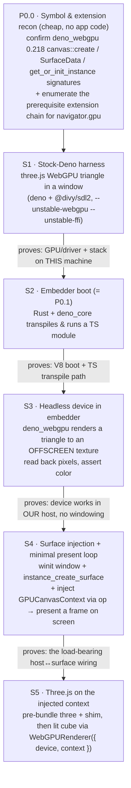
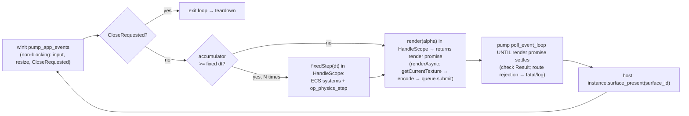
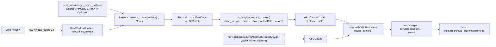

# Limina — Phase 0 Implementation Plan: Foundation

> **Status:** ✅ COMPLETE (2026-06-23) · all milestones P0.0–P0.7 + spikes S1/S3/S4 done & verified. Decisions: (1) surface **Path B** (native winit injection), (2) **native Rapier via ops**, (3) plan followed as-is. Capstone `js/src/demo.ts` runs physics→ECS→three in the windowed fixed-timestep loop (verified: 300 frames / 163 fixed steps over 2.74s → 59.5 steps/s vs 60.0 target = frame-rate-independent). `cargo build`/`clippy` clean; headless suite + source maps green.
> **Parent plan:** `plans/limina-phase-0-1-mvp/plan.md` (`plan-f3e376f601d044bd`, approved)
> **Source spec:** `README.md` · **Settled runtime:** Rust host + `deno_core` (V8) + `deno_webgpu` (wgpu) + Three.js WebGPU + native Rapier + bitECS
> **Scope:** Operationalizes the parent plan's **Phase 0 (Foundation)** checklist into a buildable, de-risked sequence. Does **not** touch the four Phase 1 agent pillars.

## Outcome

A native desktop binary where a **Rust host owns one thread**: it boots a V8 isolate via `deno_core`, transpiles and runs TypeScript, and drives a **fixed-timestep loop** that renders a **Rapier-driven lit cube** with the **Three.js WebGPU renderer** to an **OS window** — each frame presented through a `wgpu` surface the Rust host created and handed to JS. The end state is the parent plan's Phase 0 checklist, all green:

- [x] Three.js WebGPU renders on `deno_core` + `deno_webgpu` (the spike)
- [x] Rust workspace + `deno_core` boots and runs a TS module
- [x] `deno_webgpu` device + window; clear-color frame on screen
- [x] Three.js WebGPU draws a lit cube
- [x] Rapier integrated via ops; a falling body steps deterministically
- [x] Fixed-timestep accumulator loop + RenderSystem + basic input/camera
- [x] bitECS world + components + render-sync system (ECS transform → Three object)

Phase 0 ships **no skills, MCP, agents, or observability** — it builds the floor those pillars stand on.

## What changed after research (and why this plan exists)

The parent plan's Phase 0 line item — *"prove Three.js WebGPU runs on deno_core + deno_webgpu"* — hides the single largest risk in the whole program. Source-verified findings (deno main @ 2026-06, see Dependency Surface):

- **`deno_webgpu` is headless by design.** Its `request_adapter` passes `compatible_surface: None` (`// windowless`, `ext/webgpu/lib.rs`). The crate has **no surface-creation op**.
- **On-screen presentation is implemented in a different crate — `deno_canvas`** (`ext/canvas/byow.rs`, exposed to JS as `Deno.UnsafeWindowSurface`). It turns a native window handle into a `wgpu` surface and requires the handle to arrive as a `v8::External` produced through **`deno_ffi`** (`--allow-ffi`).
- **Crucially, `deno_canvas`'s `byow.rs` reaches into `deno_webgpu`'s public API** to do it: it calls `deno_webgpu::get_or_init_instance(...)`, constructs `deno_webgpu::canvas::SurfaceData { id, width, height, instance }`, and calls `deno_webgpu::canvas::create(.., ContextData::Surface(..))`. Because a *separate crate* calls them, **those symbols are necessarily cross-crate `pub`** — so a Rust host can call the same entry points directly from its own `winit` window without the FFI dance (this is "Path B" below).
- **Prior art is PROVEN only inside the full `deno` binary** — `chirsz-ever/deno-webgpu-window-demos` runs ~100 Three.js WebGPU examples on Deno via `@divy/sdl2` with `--unstable-webgpu --unstable-ffi`. For a **bespoke `deno_core` embedder it is UNPROVEN**; only the reusable Rust building blocks exist.
- **The renderer half is already de-risked upstream:** `WebGPURenderer` officially accepts an injected `GPUDevice` *and* `GPUCanvasContext` (`WebGPUBackend.js`), so Three.js reuses our device/surface instead of creating its own. The hard part is the host↔surface↔loop wiring, not Three.js.

Net: the spike must be **staged** so each stage isolates one unknown. That staging is the spine of this plan.

## The staged spike (de-risk before building)

Each stage is independently demoable and removes exactly one source of uncertainty before the next depends on it.



- **P0.0 is a paper/recon step, not app code:** confirm the exact 0.218 signatures/visibility of `deno_webgpu::canvas::create`, `ContextData::Surface`, `SurfaceData`, `get_or_init_instance` (evidence above says they're cross-crate `pub`; this verifies the precise shapes), and enumerate which companion extensions `navigator.gpu` requires (see Dependency Surface). If any Path-B symbol turns out gated, fall back to **Path A** *before* building S2/S3 — moving the fallback trigger to the cheapest possible moment.
- **S1 isolates hardware/driver risk** (RTX 3050 Mobile, Linux/X11-or-Wayland) on a known-good harness. Cheapest possible signal that the rendering stack can work here at all. If S1 fails, it's a driver/Vulkan problem, not our code.
- **S3 isolates "device in our embedder" from "windowing"** by rendering offscreen and reading pixels back — no window, no surface, no FFI. If S3 passes and S4 fails, the fault is unambiguously the surface wiring.
- **S4 is THE risk,** and births the minimal present/pump loop (single-frame, no accumulator yet). Two implementation paths; recommended default is **Path B**:
  - **Path B — native injection (recommended):** the Rust host creates a **winit** window, reads its `raw-window-handle 0.6` handles, calls `instance.instance_create_surface(display_handle, window_handle, None)` directly (using the shared instance from `get_or_init_instance`), wraps the resulting `SurfaceId` as a JS `GPUCanvasContext` via `deno_webgpu::canvas::create(.., ContextData::Surface(..))`, and **presents in Rust** via `instance.surface_present(surface_id)`. The Rust host owns window + device + surface — exactly the settled architecture. No FFI.
  - **Path A — mirror Deno (fallback):** link `deno_canvas` + `deno_ffi`, create the window in JS via an SDL FFI binding, pass handles as `v8::External` to `UnsafeWindowSurface`, present via `surface.present()` in JS. Closest to proven prior art; heavier; JS owns the window.

## Hard-to-reverse Phase 0 bets (decided)

These set conventions later code and the Phase 1 pillars build against; changing them after callers exist is expensive.

| Decision | Locked choice | Why settle now |
|---|---|---|
| Version pinning | Pin **exact `=` versions** of `deno_core`+`v8` together, and `deno_webgpu`+`deno_canvas`+`wgpu-core/types`+`raw-window-handle` together. Every upgrade is a deliberate, tested migration. | `deno_core` 0.x bumps ~weekly with breaking minors; `v8`↔`deno_core` are link-coupled; `wgpu 29`↔`rwh 0.6` is an ABI pair. A drifting lockfile silently breaks the build. |
| Window-surface path | **Path B** — native winit + `instance_create_surface` + injected `GPUCanvasContext` + Rust-side `surface_present` (Path A documented fallback, trigger at P0.0) | Matches "Rust host owns window+device+physics"; host-side present removes the renderAsync/present race (below). |
| Windowing lib | **winit 0.30**, host-driven via `pump_app_events` (`EventLoopExtPumpEvents`) — not `run_app` (which seizes the thread) | Native, Rust-owned, `rwh 0.6` ABI-matched to wgpu 29. Lets the host keep its fixed-timestep loop. |
| Loop / threading model | **Single OS thread** owns isolate + winit pump + surface present. Per frame: pump winit (non-blocking) → run accumulated fixed steps → invoke JS render → **pump `poll_event_loop` until the render promise settles** → host presents. Never `run_event_loop`-to-quiescence in the loop. | `JsRuntime` is `!Send`/`!Sync`; the surface is thread-affine; the render's `getCurrentTexture→submit` lives in awaited continuations that only advance when the loop is pumped — so we pump *until settled*, then present. |
| Host↔JS frame contract | Bootstrap registers two `v8::Global<v8::Function>` via `op_set_frame_callbacks(fixedStep, render)`. Host invokes them inside a `HandleScope`: `fixedStep(dt)` **N times** (once per accumulated step), then `render(alpha)` **once** (returns the render promise the host awaits via pumping). | `poll_event_loop` drains queues but never calls user frame code; this is the one mechanism every Phase 1 system runs through. |
| Surface-context delivery | **Op return, not a global:** `op_acquire_surface_context()` returns the `GPUCanvasContext` (built by `deno_webgpu::canvas::create`); bootstrap requests the `GPUDevice` from `navigator.gpu` (same shared instance via `get_or_init_instance`, so device+surface are compatible) and calls `new WebGPURenderer({ device, context })`. | One deterministic acquisition point; avoids global-init ordering hazards; keeps the device/surface instance-shared. |
| Internal handle convention | Engine-internal handles are **raw generational integers** (bitECS `eid`, Rapier `RigidBodyHandle`) crossing the op boundary as `#[smi]`/u32. The parent plan's **opaque `ent_…` strings are an external (agent/MCP/trace) identity assigned by the Phase 1 registry**, mapped to internal handles there — Phase 0 has no external IDs yet, so there is no conflict. | Prevents a false clash with the parent's "never raw indices" rule; fixes the boundary type before native systems multiply. |
| OpState resource ownership | Native resources live in `OpState` as `Rc<RefCell<T>>`: `PhysicsWorld` (pipeline + sets + island/broad/narrow/ccd), the shared `wgpu` instance, and `SurfaceData`. Op families fetch via `state.borrow::<T>()`. | Single ownership story for every op family; the seam Phase 1 plugs new ops into. |
| Op error propagation | Ops return `Result<T, deno_error::JsErrorBox>` (or a typed `deno_error` class) surfaced as JS exceptions; the host **checks `poll_event_loop`'s `Result`** every tick and routes JS exceptions / rejected frame promises to a logged-fatal path (not silently swallowed). | A swallowed frame error otherwise spins the loop forever; error flow is as load-bearing as data flow. |
| TypeScript | Transpile **in `ModuleLoader::load` via `deno_ast`** (swc), transpile-only (no typecheck); implement **`ModuleLoader::get_source_map`** so V8 stack traces map to TS. | deno_core does not run TS; without the source-map hook, traces point at generated JS. |

## Loop, threading & lifecycle model

One thread, owned by the Rust host.



- **Three-way interleave on one thread:** enter the tokio current-thread runtime context (`Runtime::enter`/`block_on`), then loop: `pump_app_events` (non-blocking timeout `Some(ZERO)`), run fixed steps, drive `poll_event_loop` via a `poll_fn`/manual `Context` until the frame's render promise resolves. The isolate, the winit pump, `getCurrentTexture`, and `surface_present` all stay on this thread (the surface is thread-affine).
- **`mod_evaluate` ordering:** await the module-eval future *after* the first `poll_event_loop` pump, never before (it only resolves once the loop is pumped).
- **Shutdown (CloseRequested):** exit the loop → final bounded `poll_event_loop` to drain in-flight async ops → drop the scene + `JsRuntime` (releases JS-held GPU handles) → drop `SurfaceData`/surface → device/instance drop → window closes. Clean shutdown is an acceptance criterion (P0.6).
- **Defended pitfalls (source-verified):** double-submit-before-present can freeze (`deno#23563`) — exactly one `submit` per frame then one host present; `Outdated`/`Lost` surface throws `"Invalid Surface Status"` (`deno#23407`) — reconfigure on resize; rejected frame promise → fatal/log, never swallowed.

## Surface injection data flow (Path B)



## Repository structure (Phase 0 subset)

Only what Phase 0 needs; the agent-layer dirs from the parent plan arrive in Phase 1. Existing `.eventloom/`, `.mcp.json`, `zaxy-mcp.json`, `AGENTS.md` stay untouched.

```
Cargo.toml                          # Rust workspace (crates/*)
crates/limina-runtime/              # owns the thread + tokio current-thread + fixed-timestep driver
  src/main.rs                       #   JsRuntime::new; load_main_es_module; mod_evaluate; per-frame pump+poll+present; shutdown
  src/module_loader.rs              #   ModuleLoader: resolve + deno_ast transpile (TS→JS) + get_source_map
  src/frame.rs                      #   holds v8::Global frame callbacks; HandleScope invocation of fixedStep/render
crates/limina-render/               # winit window + wgpu surface (Path B), injected as GPUCanvasContext
  src/window.rs                     #   winit window, pump_app_events, resize → surface reconfigure, CloseRequested
  src/surface.rs                    #   instance_create_surface + SurfaceData + op_acquire_surface_context + surface_present
crates/limina-physics/             # Rapier world + step op
  src/lib.rs                        #   PhysicsWorld (sets+pipeline) in OpState; op_physics_step; op_body_read/write
crates/limina-ops/                  # shared extension! registration + frame-callback op + buffer round-trip op + OpState wiring
  src/lib.rs
js/package.json                     # three, bitecs, esbuild (pre-bundle three/webgpu)
js/build/three.bundle.mjs           # esbuild output: three/webgpu + three/tsl as one ESM (built by a package script)
js/src/bootstrap.ts                 # entry: acquire context+device, build renderer/scene, register frame callbacks
js/src/ecs/world.ts                 # bitECS world + Position/Rotation/Scale (SoA Float32Array) + render-sync system
js/src/render/renderer.ts           # WebGPURenderer({ device, context }) + camera + lights + non-browser shim (width/height/domElement stub)
examples/spike/                     # S1 stock-deno harness (deno + @divy/sdl2 triangle) — kept as a regression smoke
```

## Milestones (with acceptance criteria)

Ordered so each de-risks the next. `S#` map to the staged spike.

- [ ] **P0.0 — Symbol & extension recon.** Confirm `deno_webgpu` 0.218 exposes `canvas::create`, `ContextData::Surface`, `SurfaceData`, `get_or_init_instance` cross-crate with the expected signatures; enumerate the companion extensions `navigator.gpu` needs (see Dependency Surface). *Accept:* a short note pinning the exact symbols/signatures and the extension list; Path A/B decision confirmed before any host code.
- [ ] **S1 — Stock-Deno render harness.** `deno run --unstable-webgpu --unstable-ffi` a minimal Three.js WebGPU triangle in an SDL window (`@divy/sdl2`). *Accept:* a window shows the triangle on this machine; note the GPU backend (Vulkan) + driver.
- [ ] **P0.1 (= S2) — Workspace + embedder boot.** Cargo workspace; `limina-runtime` boots `JsRuntime` on a tokio current-thread runtime, loads a `.ts` main through the `deno_ast` transpiling `ModuleLoader` (with `get_source_map`), runs it. *Accept:* a TS module prints via an `op_log` `#[op2]` op; `mod_evaluate` awaited after the first pump; a deliberate TS exception yields a **TS-line-accurate** stack trace.
- [ ] **P0.2 — `#[op2]` bridge + conventions.** `limina-ops` registers an `extension!` with: a fast sync op, a zero-copy `#[buffer]` round-trip op (JS `Float32Array` mutated in place by Rust), and an op returning `Result<_, JsErrorBox>` that throws into JS. *Accept:* byte-exact buffer round-trip asserted; the error op surfaces as a catchable JS exception; `OpState` resource fetch pattern exercised.
- [ ] **S3 — Headless device in embedder.** Register `deno_webgpu` + its prerequisite extensions; from the embedder, render a triangle to an **offscreen** texture, copy-to-buffer, read back, assert the center pixel. *Accept:* pixel assertion passes with **no window**.
- [ ] **S4 / P0.3 — Window + surface + clear frame (minimal loop born here).** `limina-render` opens a winit window, creates the surface (Path B), `op_acquire_surface_context` returns the context; JS configures it; a **minimal single-frame pump→render→present loop** shows a clear-color frame; resize reconfigures. *Accept:* a solid-color window that survives resize without `"Invalid Surface Status"`. (P0.6 later adds the accumulator/fixed-dt/input layer; this is intentionally the bare loop.)
- [ ] **P0.4a — Three.js bundle + non-browser shim.** esbuild pre-bundles `three/webgpu` + `three/tsl` into `js/build/three.bundle.mjs`; build the renderer shim (numeric `width`/`height` + `domElement`/`style` stub; drive `renderAsync`, never `setAnimationLoop`/`self`). *Accept:* the bundle loads through the `ModuleLoader` and `WebGPURenderer({ device, context })` constructs headlessly against the injected device+context (no `navigator.gpu`/canvas path taken).
- [ ] **S5 / P0.4b — Three.js lit cube.** A directional+ambient-lit cube via a TSL/Node material rendered through the injected context. *Accept:* a shaded cube on screen, redrawn each frame via `renderAsync` + host present.
- [ ] **P0.5 — Rapier via ops.** `limina-physics` builds `PhysicsWorld` in `OpState`; `op_physics_step` advances one fixed step; `op_body_read` returns a body pose; a dynamic body falls onto a static ground. *Accept:* (a) the body's Y **decreases monotonically and comes to rest at the expected contact height**; (b) the per-step state is **bit-identical across two same-binary runs** (determinism). (Free-fall `½g·t²` used only as a loose sanity bound, not the gate — Rapier's semi-implicit Euler deviates by O(dt).)
- [ ] **P0.6 — Fixed-timestep loop + camera/input + clean exit.** Accumulator (fixed dt = 1/60) driving `fixedStep` ×N → `render(alpha)` ×1 → pump-until-settled → host present; WASD/mouse camera from winit input; `CloseRequested` runs the teardown order. *Accept:* motion is smooth and frame-rate-independent; camera responds; closing the window drains ops and exits with no panic/leak diagnostics.
- [ ] **P0.7 — bitECS + render-sync.** bitECS 0.4 world; `Position`/`Rotation`/`Scale` as SoA `Float32Array`; a `renderSyncSystem` query copies ECS transforms onto Three `Object3D`s each frame; the falling body is an entity whose transform flows Rapier → (op) → ECS → Three. *Accept:* **mutating the ECS `Position`/`Rotation` arrays directly moves the cube on screen**, and removing every non-ECS transform path leaves motion unchanged (proves the sync is the only driver — observable, not just asserted in code).

## Dependency surface (verified versions)

Pin exact; expect deliberate migrations. (deno main snapshot @ 2026-06; `v8` is published on crates.io as `v8`, not `rusty_v8`.)

| Dependency | Version | Notes |
|---|---|---|
| `deno_core` | 0.404.0 (pin `=`) | `JsRuntime`, `#[op2]`, `extension!`, `poll_event_loop`, `ModuleLoader`. ~weekly breaking minors. |
| `v8` (rusty_v8) | 149.4.0 (pin `=`) | Link-coupled to `deno_core`; never mismatch. |
| `deno_ast` | matched to deno_core (`=0.52.x` line) | In-loader TS transpile (swc), no typecheck; source maps. |
| `deno_webgpu` | 0.218.0 | `navigator.gpu`/device; **headless**; `get_or_init_instance`, `canvas::create`, `SurfaceData`. |
| companion exts | versions matched to deno_webgpu 0.218 | `navigator.gpu` bring-up needs the WebIDL/web chain — at least `deno_webidl`, plus `deno_console`/`deno_web`/`deno_url` and their bundled ESM/snapshot (exact set confirmed at P0.0). |
| `deno_canvas` | 0.113.0 | `UnsafeWindowSurface` — **Path A only**. |
| `wgpu-core` / `wgpu-types` | `=29.0.1` | Surface API; ABI-paired with rwh 0.6. |
| `raw-window-handle` | 0.6.0 | Must match across winit + wgpu. |
| `winit` | 0.30.x | `pump_app_events` (`EventLoopExtPumpEvents`); rwh 0.6. |
| `rapier3d` | 0.33.0 | `BroadPhaseBvh` (renamed from `BroadPhaseMultiSap`); `PhysicsPipeline::step`; `enhanced-determinism` feature for cross-platform later. |
| `three` | 0.184.0 | `three/webgpu`, `three/tsl`; accepts injected `device`+`context`; pre-bundled via esbuild. |
| `esbuild` | latest | Bundles three into one ESM for the loader. |
| `bitecs` | 0.4.0 | Functional API (`createWorld`/`addEntity`/`addComponent`/`query`); user-owned SoA TypedArrays; legacy DSL in `bitecs/legacy`. |

## Risk register

| Risk | Severity | Mitigation |
|---|---|---|
| Surface wiring in a custom embedder is unproven | **High** | Staged spike S1→S3→S4 isolates it; **P0.0 confirms Path-B symbols before any host code** (fallback trigger moved to the cheapest moment); Path A (deno_canvas+ffi) is the proven fallback. |
| `deno_core`/`v8` weekly breaking churn | High | Exact `=` pins; upgrades are a tracked task; keep the snapshot table current. |
| `deno_webgpu` bring-up needs an under-documented extension chain | Medium | P0.0 enumerates the prerequisite exts + snapshot-vs-runtime-load choice before S3. |
| Three.js = hundreds of ES modules through a transpiling loader | Medium | P0.4a pre-bundles to one ESM via esbuild; loader resolves one file. |
| Three.js has no first-party non-browser reference | Medium | Injected `device`+`context` is upstream-official; shim surface is tiny; `renderAsync` avoids `self`/rAF. |
| `"Invalid Surface Status"` / double-submit freeze | Medium | Reconfigure on resize; exactly one `submit` then one host `surface_present` per frame. |
| **GPU device loss** (driver TDR/reset) | Low (Phase 0) | Recovery is an explicit non-goal; minimal handler = log `device.lost` and exit cleanly (no reconfigure loop). |
| X11 vs Wayland handle mismatch on this Linux box | Low | winit reports the correct rwh variant; both Xlib + Wayland supported; note `pump_app_events` blocking semantics can differ per backend — verify non-blocking at S4. |
| Rapier determinism | Low (Phase 0) | Same-binary determinism is default with stable insertion order; `enhanced-determinism` deferred to cross-platform work. |

## Scope guards / non-goals (Phase 0)

Skill/Hook Registry, MCP interface, observability/event bus, AgentComponent, Perception/Decision/Action systems, LLM providers — **all Phase 1**. No GLTF loading, no PBR material library beyond one lit material, no spatial partitioning, no browser fallback, no QuickJS isolates. Physics = one falling body + ground, not a general scene. **GPU device-loss recovery is out of scope** (log + clean exit only). The loop, ECS, renderer, op bridge, and the conventions in the bets table are built to be the seams the Phase 1 pillars plug into — nothing more.

## Open questions / decisions for sign-off

The bets table above is **committed**; flag any row to override. The items below are the highest-leverage calls that carry real tradeoffs and warrant explicit confirmation before build:

1. **Window-surface path — committing to Path B (native winit injection)?** Rust host owns window/device/surface, no FFI, matches the settled architecture; Path A (deno_canvas + deno_ffi) is the documented fallback if P0.0 finds a gated symbol. *Confirm B, or prefer A from the start (e.g. to hug proven Deno prior art).*
2. **Rapier — committing to native ops in Phase 0?** P0.5 exists to prove the native op bridge, so native rapier3d is the target. `@dimforge/rapier3d` (wasm) is **not** an acceptance-satisfying alternative (it would prove none of the bridge); it is only an emergency unblock to keep *rendering* progress alive if the bridge is hard-blocked. *Confirm native, or explicitly accept a wasm-first detour with P0.5 deferred.*
3. **Anything to pull forward from Phase 1, or trim from Phase 0?** e.g. drop input/camera (P0.6) to bare loop, or keep S1 as a permanent regression smoke vs delete after it serves its de-risk purpose.
