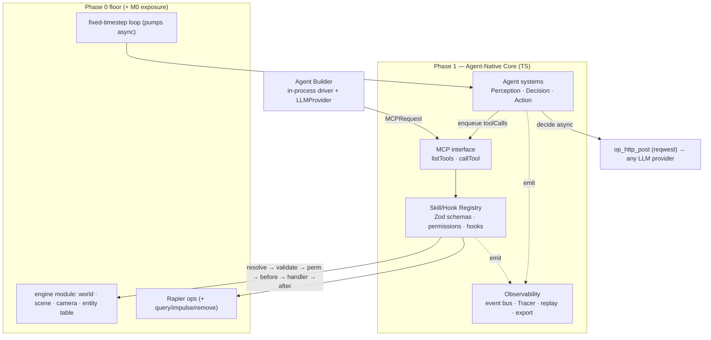
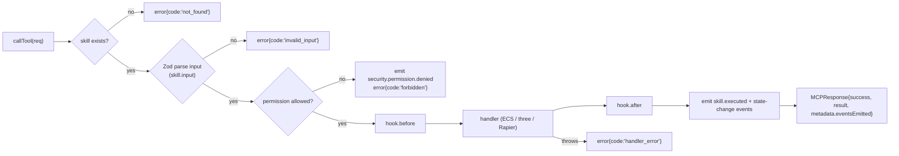
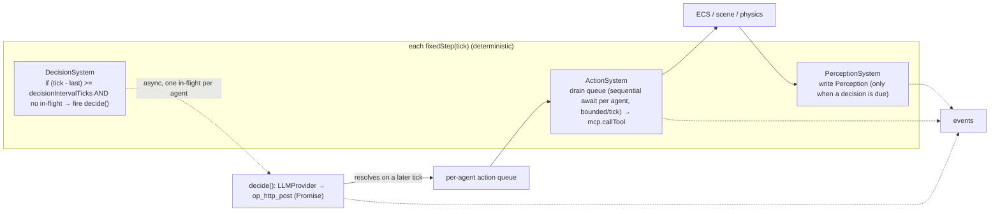

# Limina — Phase 1 Implementation Plan: Agent-Native Core

> **Status:** ✅ COMPLETE (2026-06-23) · all milestones M0–M12 built & verified. The four pillars (Skill/Hook Registry, MCP, Observability, Agent ecosystem) run over the Phase 0 floor; 16 skills; builder demo (scene over MCP, glTF, permission-enforced, traced) + player demo (windowed scripted pursuit + live Ollama `qwen2.5-coder:3b` smoke). `cargo build`/`clippy` clean; full headless suite + Phase 0 regressions green. Sign-offs honored: own EventLoom-shaped thread file, single asset root, `op_http_post` transport, Scripted+Ollama providers, MCP-network/QuickJS deferred to Phase 2, data-only permission framing.
> **Parent plan:** `plans/limina-phase-0-1-mvp/plan.md` (`plan-f3e376f601d044bd`, approved)
> **Builds on:** `plans/limina-phase-0-foundation/plan.md` (✅ complete)
> **Scope:** The four agent pillars — Skill/Hook Registry, MCP interface, Observability, Agent ecosystem — plus ~14 core skills and the two acceptance demos. **Performance-first** (standing principle): lean transport, zero-dep schema lib, O(1) registry/permission lookups, async-off-loop decisions, hot-path-free event hashing.

## Outcome

An **Agent Builder** connects to limina's **MCP interface**, discovers typed skills with `listTools`, and issues a sequence of `callTool` requests that construct a 3D scene — every call permission-checked and traced. An autonomous **Agent Player** lives in the same bitECS world running a `perception → decision → action` loop whose LLM decisions resolve **off the frame path** (the fixed-timestep loop never stalls, even on a slow local model). Every significant action emits an immutable event into a **limina trace log whose envelope matches the EventLoom shape** (so a persistence layer can consume it with no schema change). The two demos (builder, player) are the acceptance bar; the **deterministic (ScriptedProvider) paths are the tests**, the live Ollama paths are smokes.

Phase 1 is **mostly TypeScript** over the Phase 0 floor, but it is **not pure-additive**: a first milestone (M0) refactors a few Phase 0 internals into engine modules and adds four native ops. The plan is explicit about that real work below.

## What Phase 0 gives us — and what M0 must still expose

Phase 0 built the primitives; several are **module-private locals** today and must be lifted into engine modules before the registry can reach them. This is real work, not a thin wrap.

| Phase 0 reality (verified) | Phase 1 needs |
|---|---|
| `scene`, `camera`, `renderer` are `const`s **local to `js/src/demo.ts`** | M0 extracts an `engine` module that owns + **exports** them, so `WorldContext` can reference them |
| `renderables` is a **module-private** array in `js/src/ecs/world.ts`; only `spawnRenderable` exists (calls `addEntity` internally) | M0 exports a `despawnRenderable(world, eid)` (clears `renderables[eid]` + `removeEntity`); `scene.createEntity` calls `spawnRenderable` **once** |
| `PhysicsWorld` (in `crates/limina-physics`) has pipeline/sets but **no `QueryPipeline`**; handles are an **append-only `Vec<RigidBodyHandle>`** indexed by `bodyId` | M0 adds a `QueryPipeline` (updated each `step`) for `physics.raycast`, and switches handles to `Vec<Option<RigidBodyHandle>>` (or slotmap) so bodies can be removed without shifting ids; adds `op_physics_remove_body`, `op_physics_apply_impulse`, `op_physics_raycast` |
| `#[op2]` bridge + conventions | New ops follow it: `op_http_post` (LLM), `op_physics_apply_impulse`/`raycast`/`remove_body`, `op_read_asset` (sandboxed) |
| bitECS SoA `Position`/`Rotation`/`Scale` (`MAX_ENTITIES = 4096`) + `renderSyncSystem` | The agent-visible world state; skills mutate these; `scene.createEntity` enforces the 4096 cap |
| Host fixed-timestep loop: `fixedStep(dt)`×N + `render(alpha)`×1, **`poll_event_loop` pumped each frame** | Agent systems run in `fixedStep`; **async LLM promises resolve across frames for free** (no new loop machinery) |

**Honest framing:** Phase 0 retired the *rendering/runtime* risks. Phase 1's residual risks are the **agent-data contracts** (event envelope, ids, MCP wire) and the **LLM round-trip** (de-risked: Ollama `qwen2.5:7b` installed + tool-capable). M0 pays the refactor cost up front so M3+ are genuinely thin.

## System architecture



Agents (and the player's DecisionSystem) reach the world **only** through `callTool` (see the permission-boundary caveat — MVP agents are data-only, not sandboxed JS).

## Hard-to-reverse bets (decided)

| Decision | Locked choice | Why settle now |
|---|---|---|
| **Event envelope** | EventLoom-**shaped** (same field names as `.eventloom/*.jsonl`): `{ id, type, actorId, threadId, parentEventId, causedBy[], timestamp, payload, integrity{ hash, previousHash } }`. `parentEventId` is **nullable and optional** (the on-disk events use `null`; causal structure rides `causedBy`). | A persistence layer reading limina traces needs no schema change. Matching the *real* field semantics (not the parent plan's sketch) is the contract. |
| **Trace persistence model** | limina writes its **own per-session EventLoom-shaped thread file** (own genesis, `previousHash:null` at seq 1, continuous chain thereafter). It does **NOT** hand-append to Zaxy's `.eventloom/limina-default.jsonl` (that file is Zaxy-owned, with its own seq/hash scheme). A real Zaxy bridge, if ever wanted, goes through Zaxy's append API — **deferred to Phase 2**. | Corrects the earlier "append unchanged" overclaim: appending limina events mid-chain into Zaxy's file would break its hash chain and id scheme. A fresh limina thread file is itself a valid EventLoom file. |
| Event ids | Structured `evt_<actor>_<seq:012d>_<hash16>` (mirrors Zaxy's `evt_zaxy_<seq>_<hash>`: actor + monotonic per-thread seq + 16-hex content hash). | EventLoom ids encode ordering + integrity; opaque random ids would not round-trip the format. |
| Integrity chain | Each event's `integrity.hash = "sha256:" + sha256(canonical(event-without-integrity) + previousHash)`; `previousHash` = prior event's `hash` (or `null` at genesis). **Computed lazily at export**, not on the frame hot path. Canonicalization = stable key order over the envelope sans `integrity`. | Tamper-evident, self-consistent chain that verifies on re-read; zero per-frame hashing cost (performance-first). The exact Zaxy canonicalization is *not* reproduced (unknown) — limina defines its own, documented here. |
| Skill identity & versioning | `domain.action` + semver `version`; discovery via `skills.list`/`skills.describe`. | Agents hard-code names; renaming breaks scripts + traces. |
| MCP wire format | `MCPRequest{ tool, input, context? }` / `MCPResponse{ success, result?, error?{code,message}, metadata?{executionTimeMs, eventsEmitted[]} }`. Error codes: `not_found`, `invalid_input`, `forbidden`, `handler_error`, `capacity_exceeded`. | External agents + future gateway serialize against this exact shape. |
| Entity ids & lifetime | Opaque `ent_<seq>` strings in an **entity table** `Map<string, { eid, generation, mesh?, bodyId? }>`. On destroy the `ent_` entry is **deleted and never reused**; a recycled bitECS `eid` is unreachable via the old `ent_`. Handlers resolve `ent_` → entry or return `not_found`. | The async loop lands actions N frames after perception; without invalidation a recycled `eid` aliases a *different* entity → silent corruption. This realizes the parent's "never raw indices" rule under async. |
| Agent/session ids | `agt_…`, `ses_…` opaque strings. | Leak into traces/MCP/memory. |
| Permission model | Profile allow-lists (`builder.readWrite`, `player.limited`, `system.readonly`) → resolved to `ReadonlySet<string>`; per-skill `permissions[]`; check is `O(1)` membership; denial is a first-class `security.permission.denied` event, not a throw. **Boundary is convention, not enforced isolation** (see caveat). | Every skill checks it; changing the check shape touches all skills. |
| Schema library | **Zod v4 (4.4.3)** — zero deps, bare-V8 clean, bundled via esbuild. `z.toJSONSchema(schema,{target:'draft-07'})` → both MCP `input_schema` and Ollama `tools[].function.parameters`. Schemas restricted to JSON-representable types. | One schema source → validate + discover + LLM tool spec. |
| LLM transport | **Provider-agnostic async `#[op2] op_http_post`** (`url` + JSON `body` + optional `headers`) on **reqwest 0.13** (default-features off; no TLS for localhost, add `rustls-tls` for cloud). | One lean op for every provider; far lighter than `deno_fetch 0.275` (net/tls/web-ext chain). Performance-first. |
| LLM provider seam | `ScriptedProvider` (deterministic tests) · `OllamaProvider` (local smoke; `/api/chat` tools, `arguments` = parsed object) · `GatewayProvider` (cloud `/v1`, `arguments` = JSON string). Every provider **schema-validates** tool args before executing. | Ollama is slow → it's a smoke, not the test; quality/speed is a config swap. |
| Agent storage | JS-side `Map<agentId, AgentRecord>` (+ a bitECS tag linking entity→agent). | Strings/`llm` config/`perception` aren't SoA-friendly. |

## Pillar 1 — Skill/Hook Registry

```typescript
// js/src/skills/registry.ts
import { z } from "../../build/zod.bundle.mjs";

export type SkillCategory = "scene" | "ecs" | "three" | "physics" | "agent" | "system";

export interface WorldContext {           // provided by the M0 `engine` module
  ecs: unknown;                           // bitECS world
  scene: unknown; camera: unknown;        // exported from the engine module (was demo.ts local)
  entities: EntityTable;                  // ent_ -> { eid, generation, mesh?, bodyId? } (+ resolve/destroy)
  ops: EngineOps;                         // typed facade over Deno.core.ops (physics, asset)
  tick: number;
}

export interface ExecutionContext {
  agentId: string; sessionId: string;
  permissions: ReadonlySet<string>;
  world: WorldContext;
  emit(type: string, payload: unknown, causedBy?: string[]): string; // -> evt id
}

export interface SkillDefinition<I = unknown, O = unknown> {
  name: string; version: string; description: string; category: SkillCategory;
  input: z.ZodType<I>; output: z.ZodType<O>;
  permissions: string[];
  handler(input: I, ctx: ExecutionContext): Promise<O> | O;
  hooks?: { before?(input: I, ctx: ExecutionContext): Promise<void> | void;
            after?(result: O, ctx: ExecutionContext): Promise<void> | void; };
}

export interface SkillRegistry {
  register(def: SkillDefinition): void;
  describe(name: string): SkillDefinition | undefined;
  list(): MCPTool[];                       // input -> z.toJSONSchema
  invoke(name: string, input: unknown, ctx: ExecutionContext): Promise<MCPResponse>;
}
```

## Pillar 2 — MCP-style interface

The only surface external agents and the DecisionSystem see. **MVP is in-process** (drivers call `mcp.callTool` in the same isolate); a stdio/WebSocket MCP **server** is the first Phase 2 item.

```typescript
export interface MCPTool { name: string; description: string; input_schema: unknown; }
export interface MCPRequest { tool: string; input: Record<string, unknown>;
  context?: { agentId: string; sessionId: string; previousResults?: unknown[] }; }
export interface MCPResponse { success: boolean; result?: unknown;
  error?: { code: string; message: string };
  metadata?: { executionTimeMs: number; eventsEmitted: string[] }; }
```

### callTool pipeline (corrected order)

Resolve **first** (the Zod schema lives on the resolved skill), then validate, then permission, then hooks/handler. Unknown tool, invalid input, and denial are all structured outcomes, never throws.



## Pillar 3 — Observability layer

```typescript
// js/src/observability/event.ts — EventLoom-shaped (limina's own thread file).
export interface EngineEvent {
  id: string;                 // "evt_<actor>_<seq:012d>_<hash16>"
  type: string;               // "skill.executed", "agent.decision.made", …
  actorId: string;            // agentId or "engine"
  threadId: string;           // sessionId
  parentEventId: string | null;  // nullable/optional — matches on-disk (null); not a thread back-pointer
  causedBy: string[];         // explicit causal parents -> trace tree
  timestamp: string;          // ISO-8601
  payload: unknown;
  integrity?: { hash: string; previousHash: string | null }; // "sha256:…"; filled at export
}

export interface Tracer {
  emit(e: Omit<EngineEvent, "id" | "timestamp" | "integrity">): string;
  trace(actorId: string, sinceTick?: number): EngineEvent[];
  export(threadId: string): string;        // JSONL + computes the sha256 chain here
  inspect(): InspectorSnapshot;
}
```

**Storage / chain reconciliation (resolves the ring-vs-chain tension):** events accumulate in a per-session **segment**; when a segment reaches `N` events it is **flushed to the session's `.jsonl` (chain continued) and cleared** from memory — so memory stays bounded **and** the on-disk chain is complete and verifiable. `tracer.trace()` serves the in-memory tail (the replay window); full history lives on disk. `causedBy` may reference flushed ids (resolved from disk on export/inspect). No silent eviction that breaks the chain.

Canonical event types: `agent.decision.made`, `agent.perception.updated`, `agent.toolcall.rejected`, `skill.executed`, `ecs.component.added`, `three.material.updated`, `physics.impulse.applied`, `security.permission.denied`.

**Inspector (MVP):** `tracer.inspect()` → CLI/JSON snapshot (active agents, recent events/traces, permissions) + a `--trace <agentId>` runtime flag. No web devtool (parent default).

## Pillar 4 — Agent ecosystem

Systems run under the existing scheduler; **decisions are async, off the frame path** — a slow provider never touches frame rate.



```typescript
// js/src/agents/agent.ts
export interface Perception {                 // deterministic, written each decision tick
  selfId: string;                             // agt_
  selfEntity?: string;                        // ent_ the agent inhabits
  nearby: { id: string; pos: [number, number, number]; dist: number }[]; // within perceptionRadius
  recentEvents: { type: string; payload: unknown }[];
  tick: number;
}
export interface AgentRecord {
  id: string; type: "builder" | "player";
  entityId?: string;
  perceptionRadius: number;
  decisionIntervalTicks: number;              // TICKS, not ms (determinism)
  permissions: string[]; sessionId: string;
  perception?: Perception;                    // PerceptionSystem writes here
  inFlight: boolean;                          // one decision at a time
  llm?: { provider: string; model: string; systemPrompt: string };
}

// js/src/agents/llm.ts — one swappable seam.
export interface LLMProvider {
  name: string;
  decide(req: { systemPrompt: string; perception: Perception; tools: MCPTool[] }):
    Promise<{ toolCalls: MCPRequest[] }>;     // already schema-validated; [] if none/rejected
}
```

**Determinism contract:** throttling is in **ticks**; `PerceptionSystem` runs only when a decision is due (avoids O(agents×entities) every tick); a resolved decision enqueues so `ActionSystem` drains it on the **next** `fixedStep` — a fixed perception→action tick delta the M7 test asserts. `ScriptedProvider.decide()` resolves on the microtask pump but its action still lands one tick later (the test asserts that delta, not "same tick"). The `ActionSystem` drain is **sequential-await per agent, bounded per tick**; a still-pending async handler (e.g. `three.loadGLTF`) holds that agent's queue (not the frame) until it resolves.

**Rejected / hallucinated tool calls:** a tool name not in the registry → `not_found`; args failing Zod → not executed. Either case emits `agent.toolcall.rejected` and the agent simply skips (no auto-retry storm — single-shot, no multi-turn feedback in MVP). This makes "why is the live agent idle?" diagnosable from the trace.

## Core MVP skills (~14) — each wraps a Phase 0 primitive (post-M0)

| Skill | Perms | Wraps | Notes / new op |
|---|---|---|---|
| `scene.createEntity` | scene.write | `spawnRenderable` **once** (builds a default mesh from `input{ shape, color, transform, body? }`) + entity-table insert | enforces `MAX_ENTITIES`; over cap → `capacity_exceeded` |
| `scene.destroyEntity` | scene.write | `despawnRenderable` (M0 export) + `scene.remove(mesh)` + `op_physics_remove_body` + **delete `ent_` entry** | — |
| `scene.queryEntities` | scene.read | bitECS `query` + linear distance filter over `Position` | spatial index deferred (perf note) |
| `ecs.addComponent` / `removeComponent` / `updateComponent` | ecs.modify | bitECS ops / targeted SoA write | — |
| `three.setTransform` | scene.write | write ECS `Position`/`Rotation`/`Scale` (drives `renderSyncSystem`) | — |
| `three.setMaterial` | scene.write | `MeshStandardNodeMaterial` params on the entity's mesh | — |
| `three.loadGLTF` | scene.write | `GLTFLoader.parse(bytes)`; bytes from `op_read_asset(relativeId)` | **MVP = untextured geometry** (textures need ImageBitmap/DOM shims — out of scope); `op_read_asset` sandboxed + size-capped |
| `three.setLighting` | scene.write | directional + ambient params | — |
| `physics.applyImpulse` | physics.write | `bodies.get_mut(h)?.apply_impulse(v, true)` (**wake_up=true**) | `op_physics_apply_impulse` |
| `physics.raycast` | physics.read | `QueryPipeline::cast_ray` (M0 adds + per-step updates the pipeline) | `op_physics_raycast` |
| `agent.getPerception` | agent.read | read `AgentRecord.perception` | — |
| `agent.emitEvent` | agent.write | `tracer.emit` | — |
| `skills.list` / `skills.describe` | (none) | registry discovery | — |

**New native ops:** `op_http_post`, `op_physics_apply_impulse`, `op_physics_raycast`, `op_physics_remove_body`, `op_read_asset` (sandboxed). Plus M0's `QueryPipeline` + slotmap-handle refactor in `limina-physics`, and the `engine` module extraction in JS.

## Build sequence (with acceptance)

- [ ] **M0 — Expose the Phase 0 seams.** Extract a JS `engine` module owning/exporting `world`/`scene`/`camera`/`renderSync`; export `despawnRenderable`; in `limina-physics` add a `QueryPipeline` (updated each `step`), switch handles to `Vec<Option<RigidBodyHandle>>`, add `op_physics_remove_body`/`apply_impulse`/`raycast`; scaffold `op_read_asset` (sandboxed) + `op_http_post`. *Accept:* the existing `demo.ts` still runs (300-frame regression) using the extracted module; a headless test removes a body + entity and confirms the eid/bodyId are not aliased.
- [ ] **M1 — Skill Registry + ExecutionContext + hook pipeline.** *Accept:* register a dummy skill; `describe`/`list` return it; `invoke` runs `before → handler → after` in order (asserted).
- [ ] **M2 — Observability bus + EventLoom-shaped envelope.** Tracer with full envelope + structured ids; `invoke` emits `skill.executed`. *Accept:* events carry every envelope field with correct semantics (`parentEventId` nullable, `causedBy` causal); `export()` writes a **self-consistent** `.jsonl` whose `sha256:` `previousHash` chain **verifies on re-read** and whose ids follow `evt_<actor>_<seq>_<hash>`; `causedBy` reconstructs the trace tree. (NOT byte-equality with Zaxy's file.)
- [ ] **M3 — `scene.*` + `ecs.*` skills** over the M0 engine module + entity table. *Accept:* `createEntity` returns `ent_…` (single entity, capped); it appears in `query`; `updateComponent` moves it (verified via `Position` + `renderSync`); `destroyEntity` removes it and a later `createEntity` reusing the eid is **not** reachable via the old `ent_` (returns `not_found`).
- [ ] **M4 — `three.*` + `physics.*` skills** (+ the M0 physics ops). *Accept:* transform/material/lighting mutate the scene; `applyImpulse` visibly moves a **sleeping** resting body (wake works); `raycast` returns the expected hit against the live geometry; `loadGLTF` parses an **untextured** `.glb` (sandboxed asset) into the scene graph; `op_read_asset` rejects `../` and absolute paths.
- [ ] **M5 — MCP `listTools`/`callTool`** over the registry (corrected pipeline order). *Accept:* `listTools()` tools carry Zod-derived `input_schema`; `callTool` returns structured `MCPResponse` (incl. `not_found`/`invalid_input` paths) with `metadata.eventsEmitted`.
- [ ] **M6 — Permission profiles + `security.permission.denied`.** *Accept:* a `player.limited` session calling a `scene.write` skill → `forbidden` error **and** a denial event; an allowed call succeeds.
- [ ] **M7 — AgentRecord + Perception/Decision/Action systems** (tick-throttled). *Accept (deterministic):* a `ScriptedProvider` player's `Perception` is populated deterministically; a decision at tick T enqueues an action drained at T+1 that executes `physics.applyImpulse` via `callTool`; ECS state changes; the perception→action tick delta is exactly asserted; all traced.
- [ ] **M8 — LLM seam: `op_http_post` + providers** (Scripted/Ollama/Gateway-stub). *Accept:* `OllamaProvider.decide()` against `qwen2.5-coder:3b`/`qwen2.5:7b` returns ≥1 **schema-valid** `MCPRequest`; malformed/empty/unknown-tool calls emit `agent.toolcall.rejected` and are not executed; the fixed-step rate holds ~60/s while a call is in flight (measured).
- [ ] **M9 — Builder demo.** *Accept:* a driver runs `listTools` then a `callTool` sequence (create, setTransform, loadGLTF, setLighting) **plus one denied call**; the resulting scene graph + the denial are verified; the trace shows the causal chain. (Plumbing test — deterministic.)
- [ ] **M10 — Player demo** (windowed). *Accept (deterministic):* `ScriptedProvider` player acts and is traced. *Accept (live smoke):* with Ollama, **within N seconds ≥1 schema-valid tool call executes and appears in the trace with the expected causal chain**, while the fixed-step rate stays ~60/s. (Loop-not-stalled alone is NOT the criterion.)
- [ ] **M11 — Tracing + replay window + inspector.** *Accept:* `tracer.trace(agentId, sinceTick)` returns the agent's recent events; `inspect()`/`--trace` prints active agents + recent events + permissions.
- [ ] **M12 — JSON trace export.** *Accept:* `export(threadId)` writes an EventLoom-shaped `.jsonl` that round-trips: re-reading reconstructs the trace tree and the chain verifies.

## Demos (acceptance bar)

| Demo | Flow | Proves | Test vs smoke |
|---|---|---|---|
| **Builder** (`js/src/demos/builder.ts`) | driver → `listTools` → sequenced `callTool` (+ a denied call) → query | MCP + registry + permissions + tracing for creation agents | deterministic test (hard-coded sequence); optional Ollama smoke |
| **Player** (`js/src/demos/player.ts`, windowed) | player → Perception → Decision (Scripted, then Ollama) → Action → skills (impulse toward a target) → traced | shared infra serves autonomous entities; slow decisions don't stall the loop | ScriptedProvider = deterministic test; Ollama = live smoke (concrete criterion above) |

The deterministic paths prove the **plumbing**; the Ollama paths prove a real model can drive it — **not** model competence.

## Dependency additions

| Dependency | Version | For |
|---|---|---|
| `zod` (npm) | 4.4.3 | skill schemas → validation + `z.toJSONSchema`; bundled to `js/build/zod.bundle.mjs` |
| `reqwest` (crate) | 0.13 (default-features off; `rustls-tls` only for cloud) | `op_http_post` (Ollama now, any provider later) |
| `tokio` feature | add `"net"` (keep `enable_all()`) | reqwest/hyper IO driver |
| `three/examples/jsm/loaders/GLTFLoader.js` | bundled (three 0.184) | `three.loadGLTF` (untextured MVP) |
| Ollama models | `qwen2.5-coder:3b` (fast iter) · `qwen2.5:7b` (stronger tools) | local **test** provider; cloud gateway for speed/quality |

## Risk register

| Risk | Severity | Mitigation |
|---|---|---|
| Event envelope/chain wrong vs EventLoom | **High** | Matched to the *real* on-disk fields (`parentEventId` nullable, `sha256:` prefix, structured ids); limina writes its **own** valid thread file (not appended to Zaxy's); M2 verifies a self-consistent chain on re-read. |
| `op_read_asset` arbitrary file read (untrusted agents) | **High** | Host-configured **asset root**; reject absolute/`..`/symlink-escape (canonicalize + prefix-check in Rust); size cap; `loadGLTF` input is a **relative asset id**. |
| Recycled-eid aliasing under async actions | High | `ent_` deleted on destroy + never reused; generation tag; handlers return `not_found` for stale `ent_`. |
| `destroyEntity`/`raycast`/`applyImpulse` are real Phase-0 work, not wraps | Medium | M0 budgets the engine-module extraction, `despawnRenderable` export, `QueryPipeline`, slotmap handles, and the new ops **before** M3/M4. |
| 7B model emits malformed/empty tool calls | Medium | Schema-validate every call; `temperature:0`; `agent.toolcall.rejected` + skip; ScriptedProvider is the deterministic test. |
| LLM latency (local Ollama is *really slow*) | Medium | **Async off-loop**: loop never awaits a decision; one in-flight per agent + `decisionIntervalTicks`; `qwen2.5-coder:3b` or cloud for speed. |
| `loadGLTF` textured-asset DOM deps | Medium | MVP scoped to **untextured geometry**; textured (ImageBitmap/HTMLImageElement shims) is a separate budgeted task. |
| Memory growth vs complete chain | Low | Segment-flush to disk on `N` events: bounded memory + complete on-disk chain. |
| PerceptionSystem O(agents×entities)/tick | Low (MVP scale) | Run perception only when a decision is due; spatial-index trigger noted for Phase 2. |

## Permission-boundary caveat (honest)

"Agents only reach the world through `callTool`" holds in MVP **because agents are LLMs emitting tool-call *data*, not arbitrary JS**. At the language level the boundary is **not** enforced: `Position`/`Rotation`/`Scale` are exported typed arrays and `WorldContext.ops` exposes `Deno.core.ops` — any in-isolate code could bypass the registry. True capability isolation (per-agent QuickJS sandboxes) is **Phase 2**. The plan's permission model is a real, observable policy layer for the data-only agent path, not a security sandbox.

## Scope guards / non-goals (Phase 1)

~14 skills. **Single-shot** tool selection — no multi-turn. Tracing in-memory-segment + on-disk JSONL — **no Zaxy bridge, no persistent EventLoom daemon**. **MCP in-process** — no network transport. `loadGLTF` **untextured geometry only**. Permissions are profile allow-lists (data-only agents), **not** enforced sandboxing (Phase 2 QuickJS). Linear distance query — no spatial index. No skill hot-reload.

## Open questions / decisions for sign-off

The bets table is **committed**; flag any row. Highest-leverage calls:

1. **EventLoom persistence — limina's own EventLoom-shaped thread file (recommended) vs reproducing Zaxy's exact id/hash spec to append to its chain?** *Recommend own file* (honest, achievable; a Zaxy bridge via its append API is a clean Phase 2 item). Reproducing Zaxy's canonicalization needs its spec, which we don't have.
2. **`op_read_asset` policy — single configured asset root (recommended) vs an allow-list of roots?** Pick one; single root is simplest and safe.
3. **LLM transport — provider-agnostic `op_http_post` (recommended) vs `deno_fetch`.** Decided per "provider-agnostic is cool"; confirm.
4. **Live provider — ScriptedProvider (tests) + Ollama `qwen2.5-coder:3b` (smoke)?** *Recommend yes*; cloud Gateway is a config swap.
5. **MCP network transport + QuickJS sandboxes — confirm both deferred to Phase 2?** They're the natural next items but out of MVP scope.
6. **Permission boundary wording — accept "data-only agents, enforcement deferred" for MVP?** It's a real policy layer, not a sandbox; confirm that's acceptable framing.
