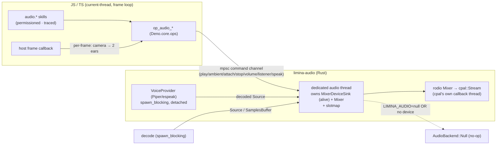

# Limina — Phase 5-B Plan: Audio (Spatial Sound + Mixer + Pluggable Voice)

> **Status:** ✅ COMPLETE & verified (2026-06-24) — B0–B5 all done. `limina-audio` (rodio 0.22.2/cpal): 4-bus mixer + spatial + 12 `audio.*` ops, permissioned/traced `audio.*` skills, Rust-side fire-and-forget TTS (espeak/Piper). Demos: party ambient+positional chatter (102 fps), forest agents **speak** their LLM lines (espeak) over an ambient bed. clippy/fmt 0; headless 52 pass (7 known-expected fails); zero regression. Procedural synthesis (no asset files); voice via espeak-ng.
> **Parent:** `plans/limina-phase-5-presentation-audio/plan.md` (P5-A Text/UI is COMPLETE; this is the executable P5-B spec) · **Roadmap:** `plans/ROADMAP.md`
> **Builds on:** Phase 0 (render + runtime + loop) · Phase 1 (skills/MCP/trace). Independent of Phases 2–4.
> **Principle:** performance-first; the engine provides presentation *capabilities*, agents drive them via typed, permission-checked, traced skills. Agent *thinking* and audio I/O run **off** the frame loop.

## ⚠️ Correction that reshapes the parent sketch

The parent plan / ROADMAP say *"spatial audio + mixer via **SDL3 (already linked)**."* **That is stale and wrong** (verified 2026-06-24): the workspace (`Cargo.toml [workspace.dependencies]`) links **no SDL / no audio crate** — the host window is **winit 0.30** (the `@divy/sdl2` reference was a throwaway Phase-0 FFI spike, never the real host). There is **zero audio anywhere** in `js/src` + `crates`. Audio is a brand-new subsystem, so SDL3's only rationale ("no new dep") collapses. **Decision: the backend is `rodio` (on `cpal`)** — pure-Rust, Linux-native (ALSA; PipeWire/Pulse compat), batteries-included decode + mixer + spatial player.

## Outcome

A native audio subsystem where **agents and builders play sound the same way they build the world** — through typed, permission-checked, traced `audio.*` skills: one-shot SFX, looping ambience, and **positional/spatial audio** (emitter attached to an entity, listener = the camera). A small **bus mixer** (master / sfx / ambience / voice). Optionally, a **pluggable local TTS** seam gives agent dialogue an actual voice. Acceptance lands as two demos that already exist: the **forest conversation speaks aloud over ambient forest audio**, and the **numbers party gains an ambient bed + positional chatter** you hear sweep past as the flythrough camera moves through the groups.

## Settled stack (verified versions/API — load-bearing)

- **`rodio` 0.22.2** on **`cpal` 0.17.3** (the version rodio 0.22.2 pins). Linux **ALSA** backend; works over PipeWire/Pulse ALSA-compat. Build dep: **`libasound2-dev`** (runtime `libasound2`). cpal's native PipeWire backend is git-only/unpublished — plan against ALSA.
- **rodio 0.22 renamed everything** (this is the trap): `OutputStream→MixerDeviceSink`, `OutputStreamBuilder→DeviceSinkBuilder`, `open_default_stream→open_default_sink`, `Sink→Player`, `SpatialSink→SpatialPlayer`, `OutputStreamHandle` removed (control via `MixerDeviceSink::mixer() -> &Mixer`). **Any ≤0.21 tutorial will not compile.** Code against 0.22.2 symbols only.
- Decode is Symphonia-backed; **rodio default features already decode WAV/OGG/MP3/FLAC/MP4**. Raw PCM via `SamplesBuffer::new(channels: NonZero<u16>, sample_rate: NonZero<u32>, Vec<f32>)` (in 0.22 `Sample = f32`).
- **`MixerDeviceSink` owns the live `cpal::Stream`** and must be kept alive for the subsystem's lifetime (drop = all audio stops + a stderr log unless `log_on_drop(false)`).
- **Spatial attenuation is rodio-internal and fixed** (inverse-square 1/d², clamped to 1.0, from emitter+two-ear positions; no rolloff/min/max knobs and **not exposed** to call/assert). Listener = two ear positions, **no orientation vector**.

## Hard-to-reverse decisions (lock at kickoff)

| Decision | Why it's load-bearing |
|---|---|
| **Backend = rodio 0.22.2 / cpal 0.17.3** (`limina-audio` crate) | All device/mixer/spatial plumbing routes through the 0.22 `MixerDeviceSink`/`Player`/`SpatialPlayer` API |
| **Ownership: a dedicated audio thread owns `MixerDeviceSink` + `Mixer` + a slotmap of `Player`/`SpatialPlayer`; ops send commands over a channel** | Never block the frame; decode/TTS off-loop. (cpal's ALSA `Stream` is `Send+Sync` and already runs its callback on its own thread, but the channel-owner pattern is the robust, portable choice and keeps a single owner.) |
| **Backend selection is EXPLICIT: `op_audio_init` honors `LIMINA_AUDIO=null` (env / OpState flag) to force `AudioBackend::Null` regardless of device; `open_default_sink()→Err(NoDevice)` is only a *runtime fallback*** | Headless ≠ no-audio: `run_headless` only means "no window," so a dev box with a sound card opens a **Live** sink headlessly. Tests MUST force Null explicitly to be deterministic + device-independent (see Testing). |
| **Spatialization model: listener = camera → two ear positions (`cam_pos ± half_head_width · cam_right`); emitter = entity world pos; rodio's fixed 1/d² as the default curve + an optional per-sound `set_volume` max-distance gain** | Mix reproducibility; the **ear derivation + the optional cutoff are limina-owned** (rodio's internal 1/d² is not). Spatial sources are **mono** (rodio downmixes). |
| **`audio.*` skill surface + 4-bus model** (master/sfx/ambience/voice) | The capability contract agents/builders author against (mirrors `ui.*`) |
| **Voice seam is RUST-SIDE + fire-and-forget** (`op_audio_speak` → `VoiceProvider` trait in `limina-audio`; synth detached, result delivered over the channel; JS never awaits) | Keeps TTS **off** the JS frame loop. A JS-awaited `op_http_post` would be driven to completion inside the per-frame `poll_event_loop` quiescence drain and freeze the frame (the Ollama stall). Engine stays substrate; the voice binary/server is external config. |
| **Asset convention: mono WAV/OGG via `op_read_asset`; SFX/chatter may be procedurally synthesized (no asset file)** | Content + the zero-asset SFX path are authored against it |
| **Audio ops are OUTPUT-ONLY: traced (`skill.executed`) but excluded from `op_physics_snapshot`/`restore` + `WorldRecorder` replay** | Mirrors render/ui; guarantees audio never leaks timing/RNG into the deterministic sim |

## Architecture & integration

- **New crate `crates/limina-audio`** — `extension!(limina_audio, ops = [op_audio_init, op_audio_play, op_audio_play_spatial, op_audio_ambient, op_audio_set_emitter, op_audio_set_listener, op_audio_set_bus_volume, op_audio_speak, op_audio_stop, op_audio_stop_all])`. `OpState` holds a small `AudioHandle { tx: Sender<AudioCmd>, mode: Live|Null }`; the audio thread owns all rodio objects. `AudioCmd` includes a `Speak { text, entity, voice_cfg }` variant. Mirrors the `limina-physics` / `limina-ecs` extension pattern.
- **`js/src/engine.ts`** — add the `op_audio_*` signatures to the `EngineOps` interface (bound via `Deno.core.ops`). `op_audio_speak` and `op_audio_play*` **return a sound handle synchronously** (the handle resolves to a player once any async synth/decode completes); **none are `Promise`-returning** — JS never awaits audio.
- **Runtime registration** — push `limina_audio::init()` into the extension lists in `crates/limina-runtime/src/main.rs` (headless + mcp-stdio + mcp-ws) and `windowed.rs`, next to `limina_physics`/`limina_ecs`/`limina_sandbox`.
- **JS layer** — `js/src/audio/manager.ts` (`AudioManager`: handle bookkeeping, bus state, the per-frame listener-sync helper) + `js/src/skills/audio.ts` (`registerAudioSkills(registry, audio)`, Zod-schema'd). Wire into `registerCoreSkills` (return `audio` in `CoreSkills`, like `ui`). The **host syncs the listener each frame** in its frame callback (`op_audio_set_listener(camera-derived ears)`) — analogous to `UiManager.update(camera, …)`. The listener is a **host** concern, **not** an agent skill.
- **Permissions/trace** — add `audio.*` keys to the profile allow-lists (like `ui.*`); every `audio.*` invoke is permission-checked and emits a `skill.executed` trace through the existing registry. **No new tracing machinery, and audio ops are excluded from snapshot/restore/replay** (output-only, like render/ui).

## Testing model (device-independent, falsifiable)

Tests set **`LIMINA_AUDIO=null`** so `op_audio_init` builds `AudioBackend::Null` — every op runs the full permission/trace/handle/state/spatial-math path with **no device and no sound**, on any machine (CI without a card *and* the dev box with one). The `NoDevice→Null` runtime fallback is a separate robustness path, **not** the test mechanism. Windowed/audible checks are explicit manual "listen" steps, never the unit gate.

## Milestones (each demoable; numeric, falsifiable, device-independent via forced Null)

- **B0 — De-risk spike: output + forced-Null + no-device fallback.** Add `limina-audio`; on a dedicated thread call `open_default_sink()`, play one synthesized WAV one-shot via the command channel; implement `AudioBackend::{Live, Null}` with `op_audio_init` honoring `LIMINA_AUDIO=null`. **Accept:** (a) windowed/Live run emits an audible blip on this box; (b) `LIMINA_AUDIO=null` run no-ops cleanly (exit 0, no stream opened); (c) device-absent run hits the `NoDevice→Null` fallback without panic; `libasound2-dev` documented. *(The only real unknown — backend + thread + null switch + ALSA-on-this-machine — proven first.)*
- **B1 — Output + decode + bus mixer.** `Player` handles; 4 buses (master/sfx/ambience/voice) with per-bus volume; looping ambience bed; `op_audio_play` / `op_audio_ambient` / `op_audio_set_bus_volume` / `op_audio_stop`. **Accept:** headless test under forced Null asserts handle/bus state transitions + `skill.executed` trace; windowed smoke plays a one-shot + an ambience loop (manual listen).
- **B2 — Spatial/positional + listener sync.** `SpatialPlayer`; emitter attached to / following an entity (`op_audio_set_emitter`); listener = camera (host per-frame `op_audio_set_listener`, two ears from the camera transform); optional per-sound max-distance gain on top of rodio's 1/d². **Accept (forced Null, deterministic, no device):** assert the **limina-owned** pure functions — (a) ear-position derivation `cam_pos ± half_head_width · cam_right` for sample camera transforms, (b) the optional max-distance `set_volume` cutoff — plus emitter/listener state plumbing. rodio's internal 1/d² panning is a **windowed manual observation** (a sound audibly pans/attenuates as the flythrough passes), **not** a unit assertion.
- **B3 — `audio.*` skills (permissioned + traced).** Full family in `js/src/skills/audio.ts` (`audio.play` / `audio.ambient` / `audio.attach` / `audio.stop` / `audio.setVolume`), Zod-schema'd, permission-gated, traced; registered in `registerCoreSkills`; profile allow-lists updated. **Accept (forced Null):** test drives `audio.*` through the registry, asserting (a) permission **denial** for an unprivileged profile, (b) `skill.executed` trace entries, (c) clean no-op output; the existing deterministic pipeline tests stay green (audio excluded from replay).
- **B4 — (optional) Pluggable TTS voice seam.** `op_audio_speak(text, entity, voice_cfg)` + `AudioCmd::Speak`; a **Rust-side** `VoiceProvider` trait (`text → WAV/PCM`) with adapters **Piper** (CLI `stdin→WAV`, or a **Rust** HTTP client to a local Piper server via `spawn_blocking` — *not* JS `op_http_post`) and **espeak-ng** (fallback / zero-install test voice). Synthesis runs detached on `spawn_blocking`; the decoded `Source` is delivered to the audio thread over the channel and played on the **voice** bus at the speaker entity's `SpatialPlayer`. `op_audio_speak` **returns a handle immediately**; JS never awaits. **Accept:** (a) **headless, forced Null, fake `VoiceProvider`:** assert `op_audio_speak` returns *before* synthesis completes (non-blocking) and the synth runs **off** the JS thread (result arrives via the command channel, not the op return) — the no-freeze property, gated; (b) provider-absent → silent + graceful (honest-unavailable, existing behavior unchanged); (c) windowed/Live with a real provider: `forest_conversation` speaks each bubble line aloud at the speaker's position **with no frame stall** (manual listen).
- **B5 — Capstone demos + gate.** (a) `forest_conversation`: spoken dialogue (B4) over an ambient forest bed; (b) `numbers_party`: ambient bed + **positional chatter blips** triggered by real `social.*` ops, audible as the camera flies through groups. **Accept:** both windowed runs verified (audible, smooth fps, clean exit — manual listen); **full headless suite (forced Null) + clippy/fmt green.**

## Sequencing & de-risking

B0 first — it isolates the single real unknown (does `rodio 0.22.2` open an ALSA sink on this box, does the thread/channel ownership hold, does the forced-Null switch + no-device fallback work). Then B1 → B2 → B3 (plumbing → spatial → agent surface). B4 (TTS) is optional/parallelizable. B5 ties it into the two existing demos. Every milestone is CI-safe because tests force **`LIMINA_AUDIO=null`** — they exercise ops/permissions/trace/spatial-math/non-blocking-speak with **no device and no sound**, identically on CI and the dev box.

## Scope guards / non-goals (first cut)

A **small bus mixer**, not a DAW / arbitrary DSP audio-graph. **No mic/voice input** (pull on demand). No music sequencing. **No in-process ONNX TTS** in the first cut (the `VoiceProvider` trait is left open for `piper-rs`/`kitten-tts-rs` later). Codec scope = rodio defaults (WAV/OGG/MP3/FLAC); author **mono** assets for spatial sources. Custom attenuation beyond 1/d²-plus-cutoff only if a demo needs it. Browser/wasm audio parity is Phase 4x's concern. **No dependency on the deferred non-blocking event-loop pump** — the Rust-side fire-and-forget voice op makes B4 safe on today's windowed loop.

## Open questions (recommended defaults)

1. **TTS in this phase, or SFX+ambience only?** — *Rec:* include **B4 as optional** (Piper primary + espeak fallback) — it's the real payoff (agents *speak*). Skippable if you'd rather ship sound-only first.
2. **Audio assets — source vs synthesize?** — *Rec:* **procedurally synthesize SFX/chatter blips** (in-code `f32` buffers → `SamplesBuffer`; zero asset files, deterministic) for B1–B3/B5; use a small **CC0 (or synthesized) mono loop** for the ambience bed. Voice needs a **Piper model download** (or `espeak-ng` installed) for B4. *(The one external prerequisite — flag if you want me to generate procedural audio vs source CC0 files, and whether to wire Piper or rely on espeak.)*
3. **Latency/buffer size?** — *Rec:* tune the output buffer toward ~1024–2048 frames for responsive SFX; **confirm the exact knob at B0** (`DeviceSinkBuilder` buffer-size config if present, else cpal `StreamConfig.buffer_size`), widen if ALSA underruns.
4. **Attenuation curve?** — *Rec:* ship rodio's fixed **1/d²** + an optional per-sound max-distance gain; richer rolloff only on demand.
5. **Spatial listener model?** — *Rec:* two ear positions from `cam_pos ± half_head_width · cam_right` (rodio has no orientation vector); ambience on a **non-spatial** bus.

## Acceptance summary (what "done" means)

Agents author sound through permission-checked, traced `audio.*` skills; positional audio tracks the camera; a bus mixer balances it; the forest agents can **speak** (Rust-side, off-loop) and the party has **ambient + spatial chatter** — all off the frame loop, all CI-safe via forced `LIMINA_AUDIO=null`, `clippy`/`fmt`/full headless suite green, both windowed demos verified audible + smooth.
